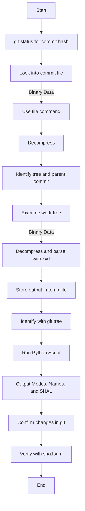

```mermaid
graph TD;
    A[Start] --> B[git status for commit hash]
    B --> C[Look into commit file]
    C -->|Binary Data| D[Use file command]
    D --> E[Decompress]
    E --> F[Identify tree and parent commit]
    F --> G[Examine work tree]
    G -->|Binary Data| H[Decompress and parse with xxd]
    H --> I[Store output in temp file]
    I --> J[Identify with git tree]
    J --> K[Run Python Script]
    K --> L[Output Modes, Names, and SHA1]
    L --> M[Confirm changes in git]
    M --> N[Verify with sha1sum]
    N --> O[End]
```
